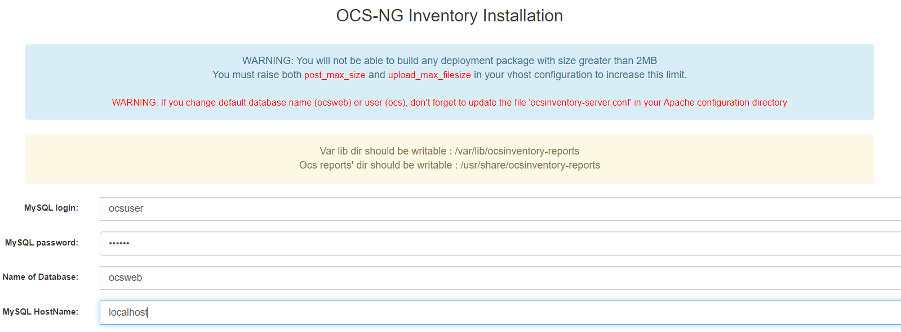
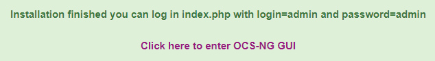
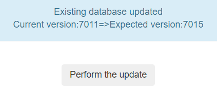
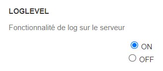
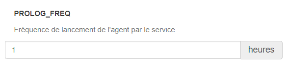
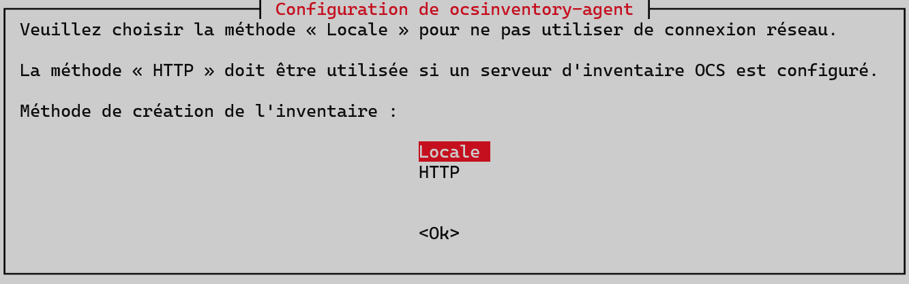
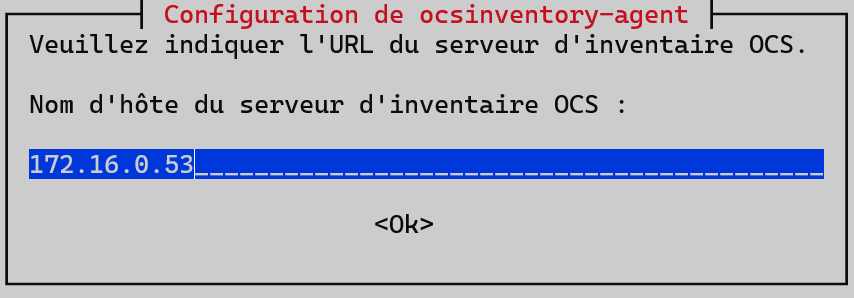
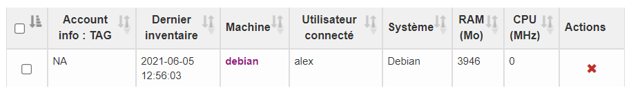
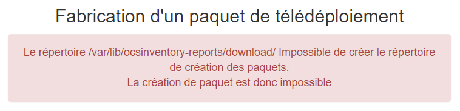
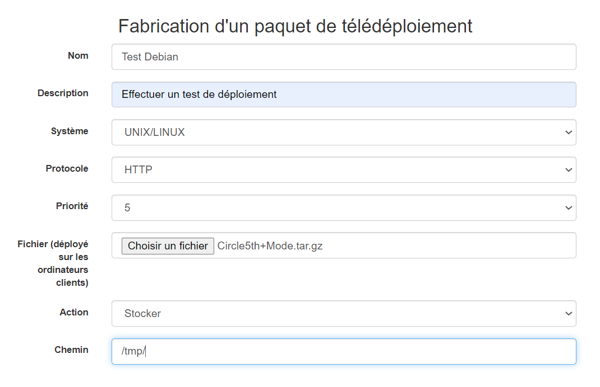

## Documentations et dépendences

- OCS Server 2.5 - Licence GNU GPL 2 - [Docs](http://wiki.ocsinventory-ng.org/)
- Ocsinventory unified agent for UNIX, Linux and MacOSX (2.4.2) - Licence GNU GPL 2 - [Docs](http://wiki.ocsinventory-ng.org/)

## Présentation

Open Computer and Software Inventory Next Generation (OCS Inventory NG) est un logiciel gratuit qui permet aux utilisateurs d'inventorier un parc de machines informatique. OCS collecte des informations sur le matériel et les logiciels des machines en réseau exécutant le programme client OCS ("OCS Inventory Agent"). OCS peut visualiser l'inventaire via une interface web. De plus, OCS inclut la capacité de déployer des applications sur des ordinateurs selon des critères de recherche. IpDiscover côté agent permet de découvrir l'intégralité des ordinateurs et périphériques en réseau.

## Topologie

| Machine        | OS          | Distribution | Version | Rôle        | Nom d'hôte | IP          |
| -------------- | ----------- | ------------ | ------- | ----------- | ---------- | ----------- |
| VM Virtual Box | GNU / Linux | Debian       | 10.9    | Ocs Server  | ocs-server | 172.16.0.53 |
| VM Virtual Box | GNU / Linux | Debian       | 10.9    | Ocs Cliente | debian     | 172.16.0.63 |

## Installation

### Prérequis

OCS nécéssite un serveur web, ainsi qu'une base de donnée pour fonctionner, on installera apache2 et mariaDB.

<AP>apt install apache2 mariadb-server mariadb-client -y</AP>

<AP>mysql\_secure\_installation</AP>

### Création de la base de donnée OCS

On créé un utilisateur *ocsuser* et lui donner tout pouvoir sur la base de donnée *ocsweb*.

<AP>mysql -uroot -p</AP>
<AP>CREATE DATABASE ocsweb CHARACTER SET utf8 COLLATE utf8_bin;</AP>
<AP>GRANT ALL PRIVILEGES ON ocsweb.&ast; TO ocsuser@localhost identified by 'ocsmdp';</AP>

### Installation d'OCS

On installe OCS via le dépôt officiel mais il est tout à fait possible de l'installer les sources du [site officiel](https://ocsinventory-ng.org/?page_id=1235&lang=fr).

<AP>apt install ocsinventory-server ocsinventory-reports -y</AP>

## Configuration

L'interface web devrait déjà être accessible via cette adresse :

http://172.16.0.53/ocsreports/

### Base de donnée



Le fichier de configuration Apache d'OCS se trouve ici : */etc/apache2/conf-enabled/ocsinventory-server.conf*, il faut modifier les lignes ci-contre :

```apache
# Master Database settings
  # Replace DATABASE_SERVER by hostname or ip of MySQL server for WRITE
  PerlSetEnv OCS_DB_HOST localhost
  # Replace DATABASE_PORT by port where running MySQL server, generally 3306
  PerlSetEnv OCS_DB_PORT 3306
  # Name of database
  PerlSetEnv OCS_DB_NAME ocsweb
  PerlSetEnv OCS_DB_LOCAL ocsweb
  # User allowed to connect to database
  PerlSetEnv OCS_DB_USER ocsuser
  # Password for user
  PerlSetVar OCS_DB_PWD ocsmdp
```

<AP>systemctl restart apache2</AP>

On poursuit sur l'interface, si tout s'est bien passé on devrait obtenir cela :



On demande d'effectuer une mise à jour de la base de donnée, on répond oui.



On devrait arriver sur cet écran d'accueil, par défaut l'utilisateur est *admin* et le mot de passe *admin*.


### Activation des logs

Aller dans le menu du haut : *configuration*, *General Configuration*, puis sur la gauche *Serveur* et enfin mettre le *LOGLEVEL* à *ON*.



Les logs iront se placer dans le répertoire : */var/log/ocsinventory-server/*

### Fréquence de lancement de l'agent

On peut modifier la fréquence en heures le lancement de l'agent par le service avec l'option *PROLOG_FREQ*, ici on choisit 1 heure.



## Collecte d'informations

La collecte d'information s'effectua au travers d'un agent OCS qu'il faut installer sur la machine dont on souhaite effectuer la gestion.

### Agent sous Debian

Commencer par installer l'agent :

<AP>apt install ocsinventory-agent</AP>

L'installation fait apparaitre cet écran et demande la méthode de transimission des informations, ici on choisit *HTTP* pour envoyer par le réseau.



On rentre l'adresse IP ou le nom DNS du serveur :



Un répertoire */var/log/ocsinventory-client* destiné à accueillir le fichier de log est également créé.

3 fichiers ont été créés :

- *etc/ocsinventory/ocsinventory-agent.cfg*, il contient l'adresse du serveur OCS :

```make
server=172.16.0.53
tag=Linux_Serveur
```

Le *tag* est une rapide description de la machine et permettra des recherches par catégorie : S'il n'a pas été précisé lors de la configuration de l'agent, il peut être ajouté ou modifié via la console d'administration du serveur.

- *etc/ocsinventory/modules.conf*, contient une liste de module qui seront chargé par l'agent lors de son éxecution :
  
- */etc/logrotate.d/ocsinventory-agent*, contient la configuration pour la rotation des logs de l'agent OCS, par défaut les fichiers sont compresséset gardé pendant 7 jours.

```make
/var/log/ocsinventory-client/*.log {
        daily
        rotate 7
        compress
        notifempty
        missingok
}
```

Pour forcer la remontée d'inventaire manuellement sans attendre le premier déclenchement, il suffit d'exécuter la commande :

<AP>ocsinventory-agent</AP>

```make
[info] [download] Download is off.
[info] [download] Beginning work. I am 2803.
[info] [download] Option turned off. Exiting.
```

On peut maintenant contrôler que le client à bien fait remonter les informations au serveur OCS. Sur l'interface OCS, dans le menu du gaut, choisir *Toutes les machines*, la Debian devrait apparaitre :



## Déploiement d'application

Pour automatiser le déployement d'application, il est nécessaire d'utiliser le protocole HTTPS basé sur l'authentification SSL.

### Création d'un certificat avec OpenSSL

Génération d'un clé privée pour le serveur Apache nommé *server.key*, il faut une taille de 2048 minimum sinon Apache n'en voudra pas.

<AP>openssl genrsa -out server.key 2048</AP>

```shell
Generating RSA private key, 2048 bit long modulus (2 primes)
.......................................................+++++
..+++++
e is 65537 (0x010001)
```

Génération d'un certficat à partir auto-signé pour le serveur Apache à partir de la clé privée nommée *server.crt*

<AP>openssl req -outform PEM -new -key server.key -x509 -days 1825 -out server.crt</AP>

**Important**, le *Common Name* doit correspondre au nom DNS ou à l'IP du serveur.

```make
You are about to be asked to enter information that will be incorporated
into your certificate request.
What you are about to enter is what is called a Distinguished Name or a DN.
There are quite a few fields but you can leave some blank
For some fields there will be a default value,
If you enter '.', the field will be left blank.
-----
Country Name (2 letter code) [AU]:FR
State or Province Name (full name) [Some-State]:Calvados
Locality Name (eg, city) []:Caen
Organization Name (eg, company) [Internet Widgits Pty Ltd]:OCS-TEST
Organizational Unit Name (eg, section) []:IT
Common Name (e.g. server FQDN or YOUR name) []:172.16.0.53
Email Address []:admin@ocs-test.fr
```

### Module SSL Apache2

Pour qu'Apache puisse utiliser HTTPS, il est nécessaire d'activer un module SSL nommé qui se trouve dans */etc/apache2/mods-available* :

<AP>a2enmod ssl</AP>

```make
Considering dependency setenvif for ssl:
Module setenvif already enabled
Considering dependency mime for ssl:
Module mime already enabled
Considering dependency socache_shmcb for ssl:
Enabling module socache_shmcb.
Enabling module ssl.
See /usr/share/doc/apache2/README.Debian.gz on how to configure SSL and create self-signed certificates.
To activate the new configuration, you need to run:
  systemctl restart apache2
```

<AP>systemctl restart apache2</AP>

Le port 443 est maintenant en écoute !

Pour voir la liste des modules actifs d'apache2 :

<AP>a2query -m</AP>

```apache
(...)
ssl (enabled by site administrator)
(...)
```

On copie la clé et le certificat dans le repertoire SSL :

<AP>cp /root/server.* /etc/ssl/private/</AP>

On va configurer Apache2 pour qu'il prenne en compte ces fichiers, par mesure de précaution on copie le fichier de configuration avant d'y toucher :

<AP>cd /etc/apache2/sites-available && cp default-ssl.conf default-ssl.conf.backup</AP>

On va modifier les lignes suivantes :

```make
SSLCertificateFile      /etc/ssl/private/server.crt
SSLCertificateKeyFile /etc/ssl/private/server.key
```

On active la configuration que l'on vient de modifier avec :

<AP>a2ensite default-ssl</AP>

```make
Enabling site default-ssl.
To activate the new configuration, you need to run:
  systemctl reload apache2
```

<AP>systemctl reload apache2</AP>

L'interface OCS devrait être disponible en HTTPS : *https://172.16.0.53/ocsreports*. Cependant comme notre certificat n'as pas été validé par un organisme de certfication, le navigateur ne le reconnait pas comme un site https valide. Evidemment en production, on évitera une telle méthode.


### Export du certificat vers le client

Pour poouvoir effectuer des déploiements d'application, il faut que l'agent OCS dispose du certificat que l'on a préalablement créé. Cepandant, il faut que celui-ci soit renommé en *cacert.pem*

On peut utiliser la commande SCP, pour effectuer une copie en SSH :

<AP>scp server.crt alex@172.16.0.51:/var/lib/ocsinventory-agent/http\:__172.16.0.53_ocsinventory/cacert.pem</AP>

### Test sur une machine Debian

Le déploiement ne se fait pas automatiquement, il faut au préalable le configurer dans l'interface OCS :

- Se rendre sur *Configuration* dans le menu en haut, puis *General configuration*, puis sur la gauche *Télédéploiement*.
- Mettre *DOWNLOAD* à *ON*
- En option, on changer les options de fréquence, de chemin des paquets qui seront installés.
- Enfin cliquer sur *Mettre à jour*.

Création d'un télédéploiement :

- Se rendre sur *Télédéploiement* dans le menu en haut, puis *Création*. Si ce message d'affiche c'est qu'Apache ne dispose pas des droits requis sur le dossier */var/lib/ocsinventory-reports*.


  
<AP>chown -R www-data:www-data /var/lib/ocsinventory-reports</AP>

On va déposer sur la machine cliente un fichier png nommé *Circle5th+Mode.PNG*, on choississant le système *UNIX/LINUX*, l'action *Stocker* et le chemin */tmp/*.



Cliquer sur *Envoyer*, une fois terminé.

- Se rendre sur *Télédéploiement* dans le menu en haut, puis *Activation*. Le déploiement que l'on vient de créer devrait être visible :


Il faut cliquer sur cet îcone pour activer le déploiement :


- Se rendre sur *Toutes les machines* dans le menu en haut, puis sélectionner la machine *Debian*.

- Dans le menu de gauche, cliquer sur *Télédéploiement* et *Ajouter un paquet*.

- Choisir *NON* pour *Utiliser les options avancées de téléploiement*, puis Valider.

- Lancer le déploiement en cliquant sur l'icône juste en dessous de *Actions* :


- Cela devrait renvoyer cette image :


Pour éviter d'attendre la prochaine connexion de l'agent, on peut forcer sur la machine cliente à se connecter au serveur OCS pour effectuer le déploiement.

<AP>ocsinventory-agent</AP>

On devrait obtenir quelque chose de similaire à cette sortie :

```shell
root@debian:/tmp# ocsinventory-agent
[info] [download] Beginning work. I am 3047.
root@debian:/tmp# [info] [download] Building package for 1622902147.
[info] [download] Checking signature for ./1622902147/tmp/build.tar.gz.
Circle5th+Mode.PNG
[info] [download] Cleaning 1622902147 package.
[info] [download] No more package to download.
```

Notre fichier est bien arrivé :

```make
-rwxrwxrwx 1 root root 319481 juin   8  2020 Circle5th+Mode.PNG
```

- Pour vérifier sur l'interface que le fichier à bien été déployer, se rendre sur *Télédéploiement* puis *Activation*, le déploiement devrait être en succès.

